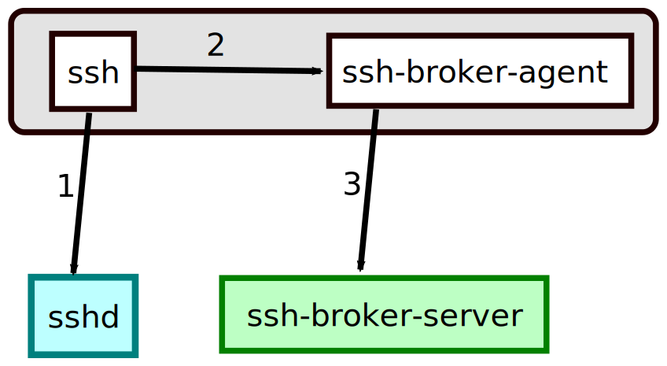

# SSH Broker

This project consists of a server which holds SSH private keys and allows clients to use those keys via a client-side ssh-agent implementation. The connection between the client and server uses mutual TLS allowing you to define authentication and authorization rules using an existing PKI infrastructure.

For the most part you could use [SSH certificates](https://github.com/openssh/openssh-portable/blob/master/PROTOCOL.certkeys) to achieve a similar security model. Check out the [BLESS](https://github.com/Netflix/bless) project for a solution based on SSH certificates. However, this project may be helpful in contexts where you cannot use certificates and are required to utilize regular public/private key pairs.

This goal of this project is to make it easier to dynamically grant and revoke access to SSH keypairs. For example, users can be granted temporary access and you will not need to rotate the SSH keys since they never leave the server.

## Architecture



1. `ssh` makes a request to a remote server and gets a signature challenge.
2. `ssh` talks to the local `ssh-broker-agent` process to do a signature.
3. `ssh-broker-agent` requests that the `ssh-broker-server` create the signature with its private key. If authorized, the signature gets returned back to the ssh process via the agent.

# Example

Here's an example starting the server:

```bash
./ssh-broker-server -authzPlugin emailWhitelist -caCert client-ca-root.pem -cert server.crt -key server.key -keyData keydata.json
```

The `keyydata.json` file contains a JSON definition of SSH keys (along with some optional metadata such as who has access to the keys):

```json
[
  {
    "name": "foo",
    "privateKey": "MIGHAgEA...",
    "metadata": {
      "emailWhitelist": ["alice@exmaple.com", "bob@example.com"]
    }
  }
]
```

On the client side, start the agent with a command such as:
```bash
./ssh-broker-agent --hostname key-server.example.com --cert client.crt --key client.key
```

Then you can access servers by setting you SSH_AUTH_SOCK environment variable:

```bash
SSH_AUTH_SOCK=/tmp/ssh-broker-agent.sock ssh user@server.example.com
```

# PKCS#11 Provider

Rather than using a custom ssh-agent, this project also provides a PKCS#11 provider that can be added to the standard OpenSSH ssh-agent. Depending on this use-case, this may be easier than managing the execution of a separate ssh-agent. As an example:

```bash
$ ssh-add -s ssh-broker-pkcs11.so
Enter passphrase for PKCS#11: 
Card added: ssh-broker-pkcs11.so
$ ssh-add -L
ecdsa-sha2-nistp256 AAAAE2VjZHNhLXNoYTItbmlzdHAyNTYAAAAIbmlzdHAyNTYAAABBBNZMszmJkWoW0DMkqRK8+aS/B+b+zVyWGoWJJaH9APo/joa5AoZPc5RxnPiiQhnX/B6JiK9NQDRaQWJOkaUtN5Q= foo
ssh-rsa AAAAB3NzaC1yc2EAAAADAQABAAABAQDBdxnnv6UKfxObNKjG/rXDb8im+wOANsUP/ybKGXgf0AlijRHvGYncH2kPyaAhfNvzaS4pjlTPlLXhoucVQJaeVJlLJlV9zbTGYk80zQrNiVaVJ6g5bJikKhWRkoeNkX8iZAX1rTAB2VMpfeoG6hoX0lUudhvZHqmth+SboL8q7MZaLnsIrQnf/cuYTVQn+WYGrkTSGtI6CZNLN3AL088m8D6ijF6pmNbR9t/d8RKgFjvSBc4yCxqUGJDXpVcq72Zo/LezIi0TtOrgRRY7ac6/9jq+aHFrPz1HiX2LkwINnvpBWq0QvW8eY0FWjJ6chW5yncF3MfoYC5bmzOQBUFcv rsa_sample
```

When loaded, the provider looks for a configuration file in `/etc/ssh-broker-pkcs11/config.json` and `${XDG_CONFIG_HOME}/ssh-broker-pkcs11/config.json`. This configuration file can contain `hostname`, `capath`, `client_cert_path`, and `client_key_path` directives. At least `hostname` is required.

## Tips

You can configure SSH to startup the agent automatically and use it with an `/.ssh/config` such as the following:

```
Match exec "~/bin/ssh-broker-agent --fork --hostname key-server.example.com --cert client.crt --key client.key"
    IdentityAgent /tmp/ssh-broker-agent.sock
```

This will cause the agent to startup automatically on first use. (Subsequent invocations will cause the agent to detect an agent already listening on the default socket path and shutdown the new invocation).

# Authorization

By default anyone with a valid certificate can use any key provided by the server. In the example above, we enable the `emailWhitelist` authorization plugin. This will look at email SANs from the client certificate and allow users with an email matching the whitelist from the key's metadata.

# Plugins

The server component is designed to be extensible, in particular supporting alternate authorization providers. Check out the [email whitelist plugin](email-whitelist-authz-plugin/authz_plugin.go) for an example plugin. 

Plugins are included at compile-time when building the server by passing included plugins into the server's `MainWithPlugins` method. Check out [the server's main() method](server/ssh-broker-server/main.go) for an example.
